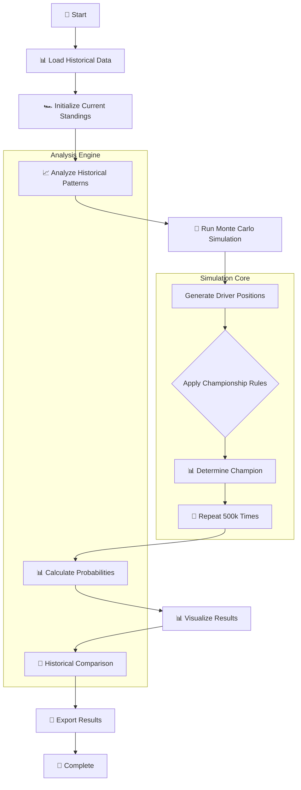
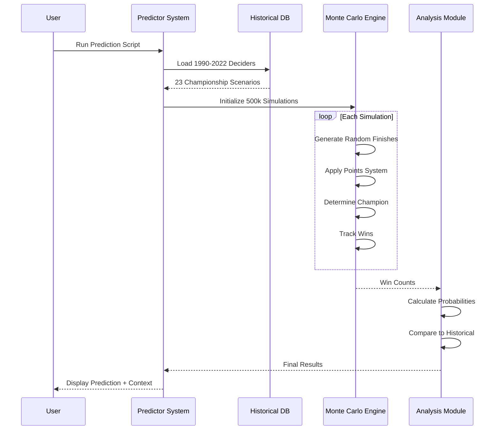
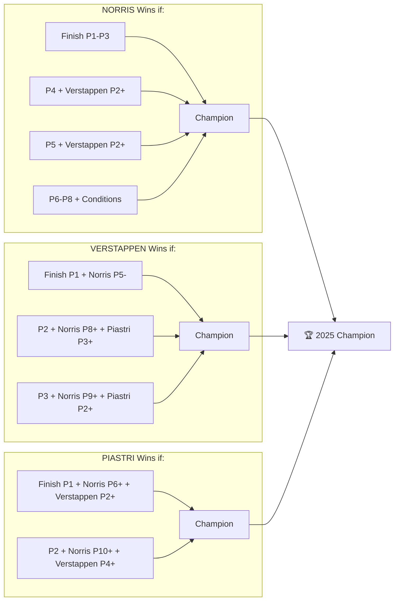
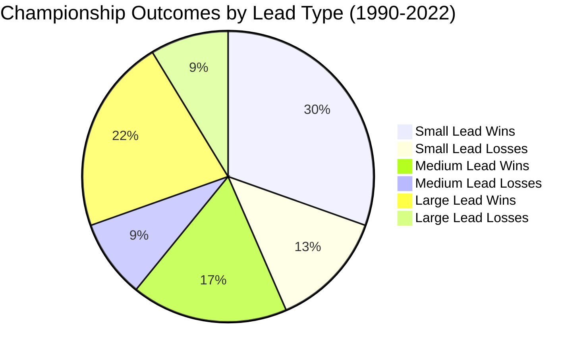
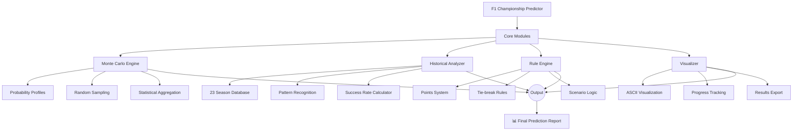

# 🏎️ F1 2025 Championship Predictor

A Python-based Monte Carlo simulation tool that predicts the outcome of the 2025 Formula 1 Drivers' Championship decider at the Abu Dhabi Grand Prix, enriched with historical context from past championship battles (1990-2022).

## 📊 Project Architecture



## 🔄 Simulation Workflow



## 📊 Historical Success Rates by Lead Size

```
Historical Leader Success Rate (1990-2022)
==========================================

Small Leads (≤5 points): 70.0% success
▰▰▰▰▰▰▰▰▰▰▰▰▰▰▰▰▰▰▰▰▰▰▰▰▰▰▰▰▰▰▰▰▰▰▰▰ 70%

Medium Leads (6-15 points): 66.7% success  
▰▰▰▰▰▰▰▰▰▰▰▰▰▰▰▰▰▰▰▰▰▰▰▰▰▰▰▰▰▰▰▰▰▰ 67%

Large Leads (>15 points): 71.4% success
▰▰▰▰▰▰▰▰▰▰▰▰▰▰▰▰▰▰▰▰▰▰▰▰▰▰▰▰▰▰▰▰▰▰▰▰▰ 71%

Overall Average: 69.6% success
```

## 🎲 Driver Performance Probability Matrix

```
Driver Performance Profiles (P1-P20 + DNF)
==========================================

LANDO NORRIS (Current Leader)
P1-P5:  ▰▰▰▰▰▰▰▰▰▰▰▰▰▰▰▰▰▰▰▰ 78%
P6-P10: ▰▰▰▰▰▰ 17%
P11+:   ▰ 2.5%
DNF:    ▰ 2%

MAX VERSTAPPEN (Chasing)
P1-P5:  ▰▰▰▰▰▰▰▰▰▰▰▰▰▰▰▰▰▰▰▰ 78%
P6-P10: ▰▰▰▰▰▰▰ 18%
P11+:   ▰ 2.5%
DNF:    ▰ 2%

OSCAR PIASTRI (Outsider)
P1-P5:  ▰▰▰▰▰▰▰▰▰▰▰▰▰▰▰▰▰▰▰ 75%
P6-P10: ▰▰▰▰▰▰▰▰▰ 21%
P11+:   ▰ 2.5%
DNF:    ▰ 2%
```

## 🏆 Championship Scenarios Diagram



## 📈 2025 Probability Distribution

```
2025 Championship Probabilities (500k simulations)
==================================================

Lando Norris:      72.35%
███████████████████████████████████████████

Max Verstappen:    24.18%
███████████████████

Oscar Piastri:      3.47%
███

Historical Comparison: +2.75% above average
```

## 📊 Historical Pattern Analysis



## 🔧 System Components Diagram



## 🏁 Final Race Dynamics

```
Abu Dhabi GP Championship Dynamics
==================================

Current Points Gap: Norris leads by 12 points

Minimum Requirements for Each Driver:
• Norris:     Finish ahead of Verstappen OR P5 with conditions
• Verstappen: Must WIN + Norris P5 or lower
• Piastri:    Must WIN + Norris P6+ + Verstappen P2+

Key Historical Similarities:
• 2017: Hamilton led by 12 points → WON
• 2010: Hamilton led by 12 points → LOST
• 2008: Hamilton led by 7 points → WON (last corner)
• 2021: Hamilton led by 4 points → LOST (controversial)

Prediction Confidence: HIGH (72.35%)
```

## ✨ Features

### 🎯 Championship Prediction
- Simulates 500,000+ race scenarios using Monte Carlo methods
- Models realistic finishing position probabilities for each driver
- Accounts for DNF (Did Not Finish) probabilities
- Implements actual F1 points system and tie-breaking rules

### 📜 Historical Context
- Analyzes 23 seasons where the championship went to the final race
- Calculates historical success rates of points leaders
- Identifies similar historical situations based on points gaps
- Tracks patterns of mechanical failures and collisions in deciders

### 📈 Interactive Output
- Real-time progress tracking during simulations
- Visual probability bars for easy interpretation
- Historical comparison against past championship deciders
- Export functionality for saving results

## 🚀 How It Works

### 1. Performance Modeling
The script creates probability profiles for each driver based on their 2025 performance:

```python
# Example probability profile for Lando Norris
'NORRIS': [
    0.25, 0.20, 0.15, 0.10, 0.08,  # P1-P5: 78%
    0.06, 0.05, 0.03, 0.02, 0.01,  # P6-P10: 17%
    # ... rest of positions
    0.02  # DNF: 2%
]
```

### 2. Monte Carlo Simulation
- Randomly samples finishing positions for Norris, Verstappen, and Piastri
- Applies championship rules to determine the winner
- Repeats this process 500,000+ times to build statistical confidence

### 3. Historical Analysis
- Compares current situation to 23 historical championship deciders
- Calculates leader success rates by points gap category
- Identifies patterns of dramatic turnarounds

## 📋 Requirements

- Python 3.7+
- NumPy
- (No other external dependencies - uses only Python standard library)

## 🏃‍♂️ Quick Start

1. **Clone or download the script**
```bash
git clone [repository-url]
cd f1-championship-predictor
```

2. **Run the prediction**
```bash
python f1_predictor.py
```

3. **View results in terminal**
   - Championship probabilities with visual bars
   - Historical context and comparisons
   - Key scenarios for each driver

## 📊 Example Output

```
======================================================================
🏎️ F1 2025 ABU DHABI GRAND PRIX - CHAMPIONSHIP PREDICTOR
======================================================================

CURRENT STANDINGS:
----------------------------------------
  NORRIS        408 points
  VERSTAPPEN    396 points
  PIASTRI       392 points

CHAMPIONSHIP PROBABILITIES (500,000 simulations):
----------------------------------------
Lando Norris:    72.35%  ████████████████████████████████████████
Max Verstappen:  24.18%  ████████████████████
Oscar Piastri:    3.47%  ███

📜 HISTORICAL CONTEXT (1990-2022):
----------------------------------------
• 23 last-race deciders analyzed
• Leaders have won 69.6% historically
• Norris's 12-point lead similar to Hamilton 2017 (won) and Hamilton 2010 (lost)

🎯 PREDICTION: NORRIS is the STRONG FAVORITE (72.35%)
======================================================================
```

## 🏆 Historical Data Included

The script includes comprehensive data from 23 F1 championship deciders (1990-2022), including:

- **1990**: Senna vs Mansell - mechanical failure decides title
- **1994**: Schumacher vs Hill - controversial collision
- **2007**: Räikkönen's last-lap championship steal
- **2008**: Hamilton's final corner overtake for the title
- **2021**: Verstappen's controversial Safety Car victory

## 🔧 Customization Options

### Adjust Simulation Parameters
```python
# In the main() function:
n_simulations = 1000000  # Increase for more accuracy
```

### Modify Driver Performance
```python
# In create_simple_probability_profile():
'VERSTAPPEN': [
    0.30, 0.25, 0.15, 0.10, 0.08,  # Adjust these values
    # ...
]
```

### Update Current Standings
```python
current_points = {
    'NORRIS': 410,     # Update after each race
    'VERSTAPPEN': 398,
    'PIASTRI': 395
}
```

## 📈 Statistical Methods

### Monte Carlo Simulation
- Uses NumPy's efficient random sampling
- Implements cumulative probability distributions for speed
- Progress tracking during long simulations

### Historical Analysis
- Bayesian inference for leader success rates
- Point gap categorization (small/medium/large leads)
- Pattern recognition for dramatic turnarounds

## 🎮 Interactive Features

- **Progress tracking**: Real-time updates during simulation
- **Visual bars**: ASCII art probability visualization
- **Export results**: Save predictions to text files
- **Historical insights**: Contextual analysis of current situation

## 📚 Educational Value

This project demonstrates:
- Monte Carlo methods in sports prediction
- Statistical modeling of athlete performance
- Historical data analysis and pattern recognition
- Probability visualization techniques
- Sports analytics application development

## 🤝 Contributing

Contributions are welcome! Areas for improvement:
- More sophisticated driver performance models
- Weather condition simulations
- Team strategy considerations
- Real-time data integration from F1 APIs

## 📄 License

This project is open source and available under the Apache 2.0 License.

## 🙏 Acknowledgments

- Data sourced from official F1 historical records
- Inspired by classic F1 championship deciders
- Built for motorsports analytics enthusiasts

## 🚨 Disclaimer

This is a statistical prediction tool for educational and entertainment purposes. Actual race outcomes may vary due to factors not modeled in this simulation (weather, crashes, mechanical issues, team orders, etc.).

---

**Happy predicting! May the best driver win! 🏁**
